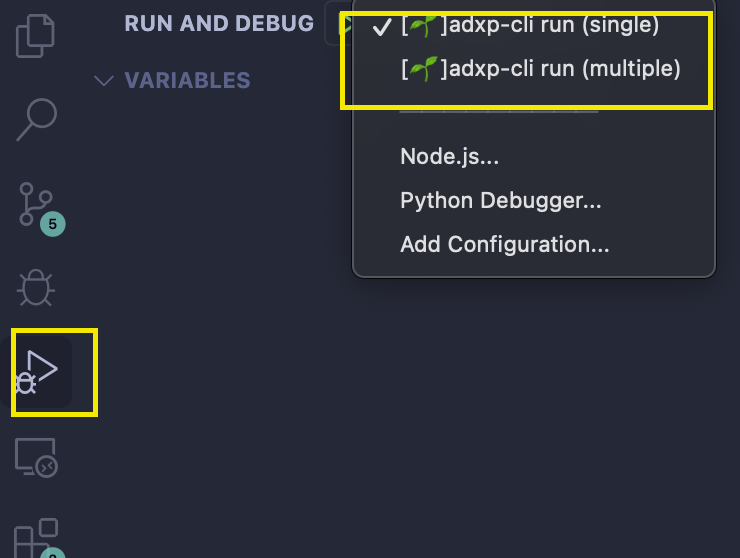
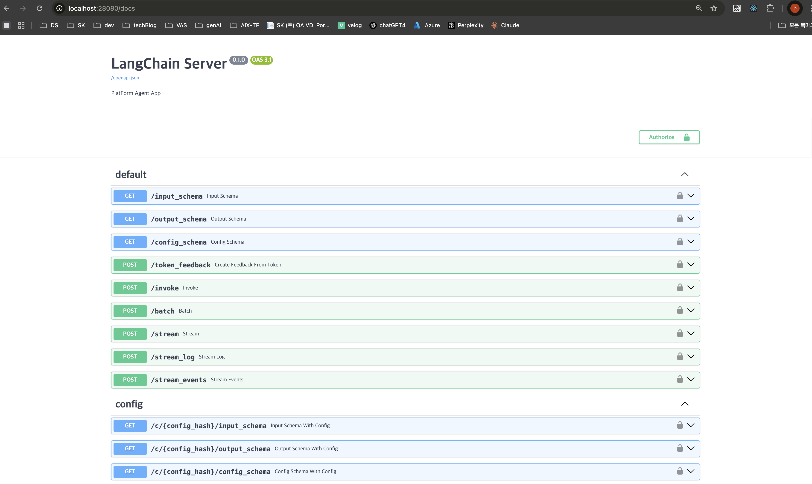
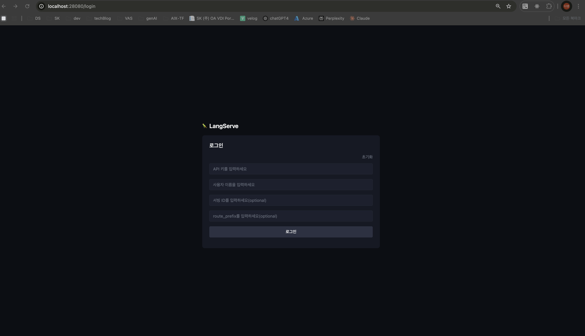
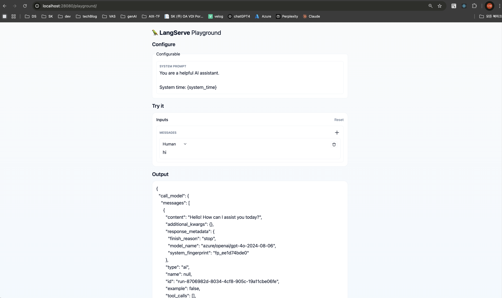

# aip-agentapp-template
AIX Platform의 CLI로 배포하는 Agent APP Template

## Prerequisite
- python >= 3.10
- docker
- pydantic >=2.10.0,<2.11.0

## create env
create env file
```
cp .env.example .env
```
Please fill in appropriate values

## Installation
1. CLI 설치 (0.1.10 이상의 버전을 사용하세요)
```
pip install adxp-cli
```
2. requirements.txt 사용하는 경우
```
pip install -r requirements.txt
```

## Launch langgraph server locally
### 1. In Terminal
```
adxp-cli agent run --host localhost --port 18080 --graph_yaml ./graph.yaml
```
### 2. Launch in Visual Studio
Click Launcher 
- adxp-cli run (single): run with graph.yaml
- adxp-cli run (multiple): run with graph-multiple.yaml


### 3. Launch with python
```
python -m adxp_cli.cli agent run --host 127.0.0.1 --port 18080 --graph_yaml ./graph.yaml
```

### 4. Edit graph.yaml
> graph.yaml (Default. Single Agent) 
- package_directory
  - Specifies the root directory of the Python package to reference when running the agent
  - Example: . (current directory)
- graph_path
  - Specifies the location of the graph object to actually use
  - Format: python_file_path:object_path
  - Example: ./simple_graph/graph.py:graph
    → Uses the graph object from simple_graph/graph.py file
- env_file
  - Specifies the path to the environment variable file (.env) to load when running the agent
  - Example: .env
- requirements_file
  - Specifies the path to the requirements.txt file containing the list of required Python packages
  - Example: ./requirements.txt

```yaml
package_directory: .
graph_path: ./simple_graph/graph.py:graph
env_file: .env
requirements_file: ./requirements.txt
```
The following APIs are created when launched
- http://localhost:28080/invoke
- http://localhost:28080/stream
- http://localhost:28080/batch

> graph-multiple.yaml (For multiple agents configuration)

This feature is supported only in adxp-cli version 0.1.6 or higher. change graph_path to **list** format

- graph_path
  - Multiple graph objects can be specified in list format
  - Each graph object has a name and object_path
    - name: Unique identifier for the graph
    - object_path: Actual location of the graph object (python_file_path:object_path)
  - In the example, 2 graph objects are created from the same graph.py file with names 'first' and 'second'

```yaml
package_directory: .
graph_path: 
  - name: first
    object_path: ./simple_graph/graph.py:graph
  - name: second
    object_path: ./simple_graph/graph.py:graph
env_file: .env
requirements_file: ./requirements.txt
```
The following APIs are created when launched
- http://localhost:28080/first/invoke
- http://localhost:28080/first/stream
- http://localhost:28080/first/batch
- http://localhost:28080/second/invoke
- http://localhost:28080/second/stream
- http://localhost:28080/second/batch


> graph-stream.yaml (To Use LangGraph Stream Mode)

This feature is supported only in adxp-cli version 0.1.10 or higher. Set `stream_mode`

If you want to know about LangGraph stream mode, See this page
-   https://langchain-ai.github.io/langgraph/how-tos/streaming/#supported-stream-modes


Supported Stream Mode
| Mode | Description |
| --- | --- |
| values | Streams the full value of the state after each step of the graph. |
| updates | Streams the updates to the state after each step of the graph. If multiple updates are made in the same step (e.g., multiple nodes are run), those updates are streamed separately. |
| custom | Streams custom data from inside your graph nodes. |
| messages | Streams 2-tuples (LLM token, metadata) from any graph nodes where an LLM is invoked. |
| debug | Streams as much information as possible throughout the execution of the graph. |

```yaml
package_directory: .
graph_path: ./custom_stream/graph.py:graph
env_file: .env
requirements_file: ./requirements.txt
stream_mode: custom
```


## Build 

### 1. Build Automatically
> rename IMAGE_NAME for docker image
```
adxp-cli agent build -t IMAGE_NAME  --graph_yaml ./graph.yaml
```

### 2. Build Via Dockerfile
2.1 Create Dockerfile
```
adxp-cli agent dockerfile --output ./sktaip.Dockerfile --graph_yaml ./graph.yaml
```
2.2 Docker build
```
docker build -t IMAGE_NAME -f ./sktaip.Dockerfile .
```
## 3. Run docker image on local
```
docker run -d -p 18080:18080 IMAGE_NAME
```
## 서버에 요청하는 방법
1. API 

> 이 API는 효율적인 /invoke, /batch 및 /stream 엔드포인트를 제공하여 단일 서버에서 많은 동시 요청을 처리할 수 있습니다.



### API 엔드포인트

#### 1. POST /invoke
- **Description**: 단일 입력에 대해 실행 가능한 작업을 호출합니다.
> **AIP RequestBody**

| key | type | description |
| --- | --- | --- |
| input | Object | Graph의 State의 schema를 따름.  (예: `simple_graph/state.py의 InputState`) |
| config | json | LangChain의 RunnableConfig.  |

> **AIP RequestHeader**

All endpoints require specific headers for authentication and request identification.
| Header Name | Required | Description |
|-------------------------|----------|-----------------------------------------------------------------------------|
| aip-user | Yes | User ID. |
| Authorization | Yes | API Key. For local testing, use a dummy value. On the platform, obtain the API Key from the web UI. |
| aip-app-serving-id | No | Container identifier used internally by the platform. |
| aip-transaction-id | No | Value to identify the request. |
| aip-company | No | Company name. |
| aip-department | No | Department name. |
| aip-chat-id | No | Value to identify the conversation. |
Note:
- aip-user and Authorization are required for all requests.
- For **local development**, you may use **any dummy value** for **Authorization**.
- On the deployed platform, you can find your API Key in the web interface. 

> **AIP ResponseBody**

| key | type | description |
| --- | --- | --- |
| output | Object | Graph의 State의 schema를 따름.  (예: `simple_graph/state.py의 InputState`) |
| metadata | json | Graph 실행의 metadata.  |

> Example

```bash
curl -X 'POST' \
  'http://localhost:28080/invoke' \
  -H 'aip-user: <any user name>' \
  -H 'secret-mode: false' \
  -H 'Authorization: <your api key>' \
  -H 'Content-Type: application/json' \
  -d '{
  "input": {
    "messages": [
            {
                "content": "kiiikiii가 누구야??",
                "type": "human"
            }]
  }
}'
```


#### 2. POST /stream
- **Description**: 단일 입력에 대해 실행 가능한 작업을 호출하고 출력을 스트리밍합니다.
> **AIP RequestBody**

| key | type | description |
| --- | --- | --- |
| input | Object | Graph의 State의 schema를 따름.  (예: `simple_graph/state.py의 InputState`) |
| config | json | LangChain의 RunnableConfig.  |

> **AIP RequestHeader**

All endpoints require specific headers for authentication and request identification.
| Header Name | Required | Description |
|-------------------------|----------|-----------------------------------------------------------------------------|
| aip-user | Yes | User ID. |
| Authorization | Yes | API Key. For local testing, use a dummy value. On the platform, obtain the API Key from the web UI. |
| aip-app-serving-id | No | Container identifier used internally by the platform. |
| aip-transaction-id | No | Value to identify the request. |
| aip-company | No | Company name. |
| aip-department | No | Department name. |
| aip-chat-id | No | Value to identify the conversation. |
Note:
- aip-user and Authorization are required for all requests.
- For **local development**, you may use **any dummy value** for **Authorization**.
- On the deployed platform, you can find your API Key in the web interface. 

> **AIP ResponseBody**

The /stream endpoint returns a Server-Sent Events (SSE) stream.
Each event contains information about the execution of nodes in the graph.
**Event Types**
- metadata
  - Contains metadata about the run (e.g., run_id).
- data
  - Contains the output of a node in the graph.
- end
  - Indicates the end of the stream.

> Example

request
```bash
curl -X 'POST' \
  'http://localhost:28080/stream' \
  -H 'aip-user: <any user name>' \
  -H 'secret-mode: false' \
  -H 'Authorization: <your api key>' \
  -H 'Content-Type: application/json' \
  -d '{
  "input": {
    "messages": [
            {
                "content": "kiiikiii가 누구야??",
                "type": "human"
            }]
  }
}'
```

response
```
event: metadata
data: {"run_id": "<unique-run-id>"}

event: data
data: {
  "<node_id>": <node_output>
}

event: end

```


#### 3. POST /batch  
- **Description**: 여러 입력에 대해 일괄적으로 실행 가능한 작업을 호출합니다.
> **AIP RequestBody**

| key | type | description |
| --- | --- | --- |
| inputs | list[Object] | Graph의 State의 schema를 따름.  (예: `simple_graph/state.py의 InputState`) |
| config | json | LangChain의 RunnableConfig.  |

> **AIP RequestHeader**

All endpoints require specific headers for authentication and request identification.
| Header Name | Required | Description |
|-------------------------|----------|-----------------------------------------------------------------------------|
| aip-user | Yes | User ID. |
| Authorization | Yes | API Key. For local testing, use a dummy value. On the platform, obtain the API Key from the web UI. |
| aip-app-serving-id | No | Container identifier used internally by the platform. |
| aip-transaction-id | No | Value to identify the request. |
| aip-company | No | Company name. |
| aip-department | No | Department name. |
| aip-chat-id | No | Value to identify the conversation. |
Note:
- aip-user and Authorization are required for all requests.
- For **local development**, you may use **any dummy value** for **Authorization**.
- On the deployed platform, you can find your API Key in the web interface. 

> **AIP ResponseBody**

| key | type | description |
| --- | --- | --- |
| output | Object | Graph의 State의 schema를 따름.  (예: `simple_graph/state.py의 InputState`) |
| metadata | json | Graph 실행의 metadata.  |

> Example

```bash
curl --location 'http://localhost:18080/batch' \
--header 'authorization: <your api key>' \
--header 'aip-user: <any user name>' \
--header 'Content-Type: application/json' \
--data '{
    "inputs": [
        {
            "messages": [
                {
                    "content": "kiiikiii가 누구야??",
                    "type": "human"
                }
            ]
        },
        {
            "messages": [
                {
                    "content": "IVE가  누구야??",
                    "type": "human"
                }
            ]
        }
    ]
}'
```


2. Python

```python
from langserve import RemoteRunnable

headers = {
    "aip-user": "<any user name",
    "Authorization": "<your api key></your>",
}

agent = RemoteRunnable(
    "http://localhost:28080",
    headers=headers,
)
response = agent.invoke(
    {"messages": [{"content": "Hi", "type": "human"}]}
)
print(response)
assert response

```

3. Playground
3.1 Login Page
> http://localhost:28080/login \
`api_key` and `user_name` is required



3.2 Playground

> Run Graph via Playground. Add user Question at Input Message Form




### PAAS custom agent 용 가이드
- PAAS시스템은 뉴로 환경 내 서비스 앱 내에서만 접근 가능하므로 로컬 서버 테스트 불가.
- 로직이 구현된 graph_paas.py파일의 권한을 수정(chmod 666 custom_stream/graph_paas.py)하여 이미지 반입 후 vi(vim)모드로 수정해가며 디버깅해야함.
1. git clone 후 .env파일 생성 및 환경에 맟게 PAAS_PRD_ENDPOINT 또는 PAAS_STG_ENDPOINT 정의
   ```yaml
    PAAS_PRD_ENDPOINT=http://61.250.32.73:31000/pe/chat-completions/stream
    PAAS_STG_ENDPOINT=http://61.250.32.73:32000/pe/chat-completions/stream
   ```
3. graph_paas.py 작업
4. sktaip.Dockerfile 파일 루트 경로에 생성
   ```yaml
    ARG PLATFORM_ARCH="linux/amd64"
    FROM --platform=${PLATFORM_ARCH} python:3.10-bookworm
    ENV LANG=C.UTF-8 LC_ALL=C.UTF-8
    ENV PYTHONUNBUFFERED=1
    RUN apt-get update && \
        apt-get install -y vim curl yq jq
    RUN addgroup -gid 1000 usergroup && \
        adduser user \
        --disabled-password \
        -u 1000 --gecos "" \
        --ingroup 0 \
        --ingroup usergroup && \
        mkdir -p /workdir && \
        chown -R user:usergroup /workdir
    WORKDIR /workdir
    USER user
    ENV HOME=/home/user
    ENV PATH="${HOME}/.local/bin:${PATH}"
    ENV WORKER_CLASS="uvicorn.workers.UvicornWorker"
    ENV APP__HOST=0.0.0.0
    ENV APP__PORT=18080
    ENV LOG_LEVEL=info
    ENV GRACEFUL_TIMEOUT=600
    ENV TIMEOUT=600
    ENV KEEP_ALIVE=600
    # For distinguishing between deployed app and agent-backend
    ENV IS_DEPLOYED_APP=true
    ADD . /workdir/.
    RUN python -m pip install adxp-sdk
    RUN python -m pip install -r ./requirements_paas.txt
    RUN echo 'import os' > /workdir/server.py && \
        echo 'from adxp_sdk.serves.server import get_server' >> /workdir/server.py && \
        echo '' >> /workdir/server.py && \
        echo 'app = get_server("./custom_stream/graph_paas.py:runnable", ".env" , "custom")' >> /workdir/server.py
    ENV APP_MODULE="server:app"
    EXPOSE 18080
    SHELL ["/bin/sh", "-c"]
    CMD python -m uvicorn ${APP_MODULE} \
        --host ${APP__HOST} \
        --port ${APP__PORT} \
        --reload \
        --log-level ${LOG_LEVEL}
   ```
5. 빌드
예)
docker build --no-cache -f sktaip.Dockerfile --platform=linux/amd64 -t aip-harbor.sktai.io/sktai/agent/app:custom-agent-paas-v1.7-prd .
docker push --platform=linux/amd64 aip-harbor.sktai.io/sktai/agent/app:custom-agent-paas-v1.7-prd

> graph-paas-stream.yaml  
- package_directory
  - Specifies the root directory of the Python package to reference when running the paas custom agent
  - Example: . (current directory)
- graph_path
  - Specifies the location of the graph object to actually use
  - Format: python_file_path:object_path
  - Example: ./custom_stream/graph_paas.py:runnable
- env_file
  - make env file with end point of PAASS
  - Example: .env
- requirements_file
  - Specifies the path to the requirements.txt file containing the list of required Python packages
  - Example: ./requirements_paas.txt

```yaml
package_directory: .
graph_path: ./custom_stream/graph_paas.py:runnable
env_file: .env
requirements_file: ./requirements.txt
stream_mode: custom
```
